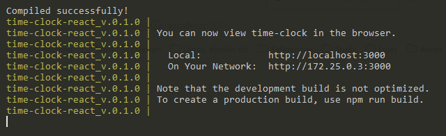

# Time Clock

## Introduction

The Time Clock is an app to easily register your working time. You can punch in every time you start working, and with another simple click punch out. When the working period is finished and after you punch out, you will see a total of hours worked daily and monthly.


## Installation

Open the terminal, then download the project from the Gitlab repository*. Access the main folder of the application, you should be able to see a file named "Dockerfile", then run the following command to install the project.


```bash
docker-compose up
```

*You'll need a invitation to the project's repository, and you have to have Docker installed in your computer.


## Starting the application

You don't need to do anything else. Once the docker image and containers are created, and the node modules are installed, the app will start automatically. All that might take a while. Just wait for a message like the image below.





## Open the app

You just need to [click  here](http://localhost:3000) or open the URL <http://localhost:3000> in your browser.


## How to use it

You'll need a user and a password to access the app functionalities.<br/>
So, fill out the fields with "0.1" and "admin" to have access to all functionalities, or an employee's username and password.<br/>
If you don't have a username and a password yourself, just add one at the "Admin" page.<br/>

### Adding the time in/out to your time clock

Just pick a date and a time and click on the "Punch in/out" button.<br/>

### Remove a time in/out

Click over a time on the time list.

### Fixing a wrong input

Remove the wrong one and add a new one with the right information.<br/>
Just mind the pairs of in/out clocked time. Otherwise, it is not possible to calculate the time.<br/>

### Adding breaks

You don't need to worry about punch in breaks, once breaks are the time between a punched out time and the next punched in time.<br/>

### Future improvements for the project 

- A real connection to a database to have better management of the data.
- A real sign in system with real passwords.
- A blockage to delete all user's without restriction.
- A way to add an administrator user from the app itself, not an input to the db.json (database).
- Administrator should be able to edit the user's information.
- Administrator's option to block the employee's time, so employees don't change them after a while. 
- Administrator's option to block a user without deleting them. 
- Administrator should be able to see a total of monthly and daily breaks.

### TODO:

Unit tests
